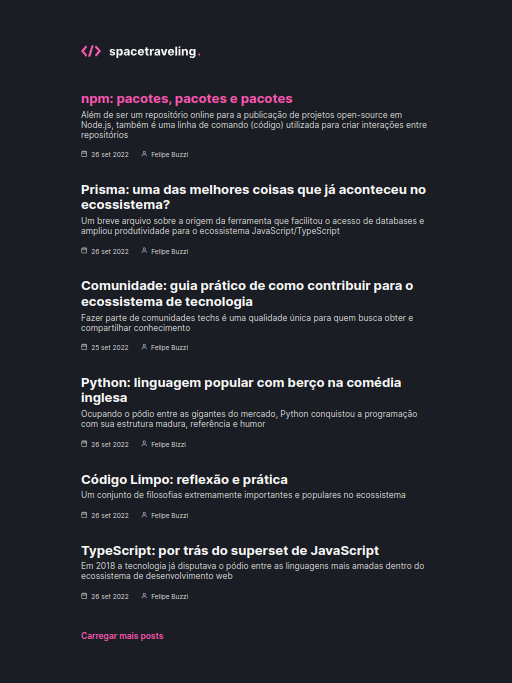

<p align="center">
  
</p>

<h2 align="center">
   Space Traveling | 
</h2>

<p align="center">
  
  
  
  
</p>

---

## 💻 Apresentação

**Space Traveling** é uma aplicação onde de blog onde consome dados vindo do Prismic.

- Estilizações global, comum e individuais;
- Importação de fontes Google;
- Paginação de posts;
- Cálculo de tempo estimado de leitura do post;
- Geração de páginas estáticas com os métodos `getStaticProps` e `getStaticPaths`;
- Formatação de datas com `date-fns`;
- Uso de ícones com `react-icons`;
- Requisições HTTP com `fetch`;
- Entre outros.


Descrição completa do desafio: [Desafio 01 - Criando um projeto do zero](./docs/Desafio%2001%20-%20Criando%20um%20projeto%20do%20zero.md.md)

## 🧭 Como rodar o projeto

**Setup Variáveis de Ambiente:** criar o arquivo `.env` na raiz do projeto e preencher os valores das variáveis de ambiente.

```dotenv
PRISMIC_API_ENDPOINT="YOUR_PRISMIC_API_ENDPOINT"
```

**Instale as dependências**

```bash
npm install
```

**Execute a aplicação**

```bash
npm run dev
```

- Acesse o front da aplicação em [http://localhost:3000](http://localhost:5173)

## 🔖 Layout

Você pode visualizar o layout do projeto através [desse link](https://www.figma.com/file/64bvp2awLuaF1B1N6MNSHa/). É necessário ter conta no [Figma](https://figma.com) para acessá-lo.


## 🚀 Tecnologias

Esse projeto foi desenvolvido com as seguintes tecnologias:

- [Prismic](https://prismic.io/)
- [ReactJS](https://pt-br.reactjs.org/)
- [SASS](https://sass-lang.com/)
- [TypeScript](https://www.typescriptlang.org/pt/)

## 📝 Licença

Esse projeto está sob a licença MIT. Veja o arquivo [LICENSE](LICENSE) para mais detalhes.
