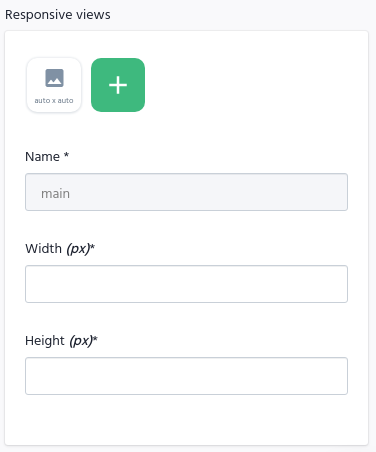

# Desafio 01 - Criando um projeto do zero

Módulo: Módulo 3
Status: Not started
Trilha: React

# 💻 Sobre o desafio

Nesse desafio, você deverá criar uma aplicação para treinar o que aprendeu até agora no ReactJS

Essa será uma aplicação onde o seu principal objetivo é criar um blog do zero. Você vai receber uma aplicação praticamente em branco que deve consumir os dados do Prismic e ter a interface implementada conforme o layout do Figma. Você terá acesso a diversos arquivos para implementar:

- Estilizações global, comun e individuais;
- Importação de fontes Google;
- Paginação de posts;
- Cálculo de tempo estimado de leitura do post;
- Geração de páginas estáticas com os métodos `getStaticProps` e `getStaticPaths`;
- Formatação de datas com `date-fns`;
- Uso de ícones com `react-icons`;
- Requisições HTTP com `fetch`;
- Entre outros.

A seguir veremos com mais detalhes o que e como precisa ser feito 🚀

# Template da aplicação

Para realizar esse desafio, criamos para você esse modelo que você deve utilizar como um template do GitHub.

O template está disponível na seguinte URL:

[](https://github.com/rocketseat-education/ignite-template-reactjs-criando-um-projeto-do-zero)

**Dica**: Caso não saiba utilizar repositórios do GitHub como template, temos um guia em **[nosso FAQ](https://www.notion.so/FAQ-Desafios-ddd8fcdf2339436a816a0d9e45767664).**

# Se preparando para o desafio

Para esse desafio, iremos reforçar alguns pontos e apresentar algumas libs para te ajudar no desenvolvimento.

Começando pelo tema do projeto: criando um projeto do zero. Como isso é inviável por causa dos testes e algumas verificações que precisamos que vocês sigam, criamos um projeto com a menor quantidade de código possível. A idéia é se assemelhar a um projeto recém criado com a CLI do Next.js.

Dessa forma, antes de ir diretamente para o código do desafio, explicaremos um pouquinho de:

- Prismic;
- Figma;
- fetch;
- react-icons;
- date-fns.

Vamos nessa?

## Prismic

Como você já deve ter visto nas aulas, o Prismic é uma Headless CMS. Vamos utilizá-lo para gerar documentos repetíveis (post) que vão retornar alguns dados para a aplicação. Nesse ponto, é muito importante que você siga **exatamente** a estrutura que vai ser apresentada aqui pois os testes **dependem** disso.

Vou deixar abaixo um video mostrando a estrutura do Documento e um exemplo de Publicação para você se familiarizar. Esse vídeo utilizou a versão Legacy do prismic, mas você pode fazer o mesmo utilizando o Slicemachine. Em seguida, discutiremos campo a campo.

[assets/prismic.mp4](assets/prismic.mp4)

No vídeo apresentado, foi possível ver que nosso documento repetível `posts` tem 8 campos. Vamos descrever cada um deles:

- **slug**
  - Tipo: UID
  - Descrição: Identificador único amigável de cada post. Pode receber um valor manualmente ou é gerado automaticamente a partir do primeiro campo de texto preenchido. Esse campo vai ser utilizado na navegação do Next.
- **title**
  - Tipo: Key Text
  - Descrição: Input de strings. Recebe valores manualmente. Esse campo será utilizado como título do Post.
- **subtitle**
  - Tipo: Key Text
  - Descrição: Input de strings. Recebe valores manualmente. Esse campo será utilizado como subtítulo do Post.
- **author**
  - Tipo: Key Text
  - Descrição: Input de strings. Recebe valores manualmente. Esse campo será utilizado como nome do autor do Post.
- **banner**

  - Tipo: Image
  - Configurações do campo:

    

  - Descrição: Input de imagens. Recebe valores manualmente. Esse campo será utilizado como banner do Post.

- **content**

  - Tipo: Group
  - Descrição: Grupo de campos repetíveis. Esse campo será utilizado como o conteúdo do Post. O conteúdo será dividido em seções com um campo `heading` e um campo `body`.
  - Campos internos:

    - **heading**
      - Tipo: Key Text
      - Descrição: Input de strings. Recebe valores manualmente. Esse campo será utilizado como título da seção do Post.
    - **body**

      - Tipo: Rich Text
      - Configurações do campo:

        

      - Descrição: Input de _rich text_ (HTML). Recebe valores manualmente. Esse campo será utilizado como conteúdo da seção do Post. Perceba que nas configurações do campo, selecionamos algumas opções para que o seu texto tenha varias formatações (negrito, hyperlinks, listas, etc.).

Mesmo com as explicações acima, ficou em dúvida de como ficarão esses campos na sua página? Deixamos abaixo um print descrevendo cada campo no resultado final para te ajudar:


1. slug
2. banner
3. title
4. first_publication_date (campo gerado automaticamente pelo Prismic)
5. author
6. content (primeiro grupo)
7. content (segundo grupo)
8. heading (primeiro grupo)
9. body (primeiro grupo)
10. heading (segundo grupo)
11. body (segundo grupo)

Esperamos que dessa forma tenha ficado clara a estrutura e o uso de cada campo no resultado final.

Por fim, vamos falar rapidamente dos métodos que esperamos que você utilize em cada arquivo:

**PS**: Durante as aulas era utilizado a versão 4.0 do Prismic, que possui o método `query` para buscar dados. Na nova versão do Prismic, acima da 6.0 utilizamos métodos como o `getbyType` para buscar os dados. A sintaxe é muito parecida, mas caso você tenha alguma dúvida pode sempre olhar na documentação ou pedir ajuda à comunidade no fórum 💜

- **src/pages/index.tsx**: Utilizar o método `getByType` para retornar todos os `posts` já com paginação. Por padrão, a paginação vem configurada como 20. Portanto se quiser testar sem ter que criar mais de 20 posts, altere a opção `pageSize` para o valor que deseja.
- **src/pages/posts/[slug.tsx]**: Utilizar o método `getByType` para buscar todos os `posts` e o `getByUID` para buscar as informações do `post` específico.

Além disso, não esqueça de configurar no arquivo `.env.local` na raiz do seu projeto a variável `PRISMIC_API_ENDPOINT` com a url da sua API


Caso tenha dúvidas, dê uma olhada na documentação oficial do Prismic, que já está atualizada com os novos métodos como `getByType`

[Set up Prismic with Next.js](https://prismic.io/docs/technologies/setup-nextjs)

[Next.js & Prismic](https://prismic.io/docs/technologies/getting-started-nextjs)

[Prismic w/ Javascript - Prismic](https://prismic.io/docs/technologies/javascript)

[Prismic Help Center](https://intercom.help/prismicio/en/)

## Figma

Um ponto muito importante desse desafio que queremos que vocês exercitem é a implementação de uma interface a partir de um layout do Figma, como se você tivesse recebido isso das mãos de um designer.

Nesse desafio, você deve implementar o layout da página `Obrigatório`.

Para utilizar o Figma, não possui muito mistério. Vamos deixar abaixo os passos para criar uma conta, duplicar o layout e exportar imagens.

### Criando uma conta no Figma

Para acessar o Layout da aplicação, você primeiramente deve ter uma conta criada na plataforma do Figma, para isso, você pode [clicar aqui](https://www.figma.com/signup).

Então, na página de cadastro, você pode logar diretamente com sua conta do Google ou criar uma conta com o e-mail que você preferir.

### Utilizando o Figma

Após criar sua conta, você pode acessar sua Dashboard do Figma, para isso, basta acessar [https://www.figma.com/](https://www.figma.com/) e ele vai te redirecionar para a Dashboard.

<aside>
💡 Caso ele não redirecione diretamente para a sua dashboard, existe um botão "Log in" no canto superior direito da tela, que permitirá você acessar a conta que você acabou de criar e, ao logar, você será redirecionado automaticamente.

</aside>

### Acessando o layout do app

Agora para duplicar os layouts, basta você clicar no link abaixo. Ele adicionará o Layout à sua dashboard do Figma automaticamente, como uma cópia.

[Desafios Módulo 3 ReactJS](https://www.figma.com/file/0Y26j0tf1K2WB5c1ja5hov/Desafios-M%C3%B3dulo-3-ReactJS/duplicate)

### Verificando estilização

Para verificar a estilização de um elemento, basta selecioná-lo e escolhar na barra lateral direito a opção `Inspect` no menu superior direito. Dessa forma você vai ter a maioria das informações que precisa. Caso precise das distâncias em relação a outros elementos, basta colocar o mouse em cima do elemento que deseja pegar a distância.

[assets/figma.mp4](assets/figma.mp4)

### Exportando do Figma

Se você está tendo dificuldades em encontrar o comando `Export` no layout do Figma, siga esses passos:

- Selecione o item que deseja exportar;
- Na sidebar direita, clique na aba `Design`;
- Deslize até o final da sidebar para encontrar a opção `Export`.

[assets/figma2.mp4](assets/figma2.mp4)

## fetch

Para que você consiga realizar a paginação, é preciso trabalhar com a propriedade `next_page` retornada no método `getByType`. Ela retorna um link que vai buscar a próxima página da paginação.

Dessa forma, para realizar essa única requisição no seu projeto, é **obrigatório** que você utilize o `fetch` já disponível de forma global.

Caso tenha dúvidas de como utilizar, o Diego utilizou o `fetch` no primeiro módulo, lá dentro do `RepositoryList.tsx`. Deixaremos abaixo também a documentação oficial

[Usando Fetch](https://developer.mozilla.org/pt-BR/docs/Web/API/Fetch_API/Using_Fetch)

## react-icons

Para exibir os ícones de data de criação, tempo estimado de leitura e autor do post sugerimos utilizar a lib `react-icons` já instalada no seu template. Todos os três icones são da coleção `Feather Icons`.

Caso tenha dúvidas de como utilizar, dê uma olhada na documentação oficial.

[React Icons](https://react-icons.github.io/react-icons/)

## date-fns

Para realizar a formatação das datas, sugerimos utilizar a lib `date-fns` já instalada no seu template. O único método que você precisa utilizar é o `format` informando o `locale` como `pt-BR`. Segue abaixo um rápido exemplo:

```tsx
import { format } from 'date-fns';
import ptBR from 'date-fns/locale/pt-BR';

format(new Date(), "'Hoje é' eeee", {
  locale: ptBR,
});
```

Caso tenha dúvidas de como utilizar, dê uma olhada na documentação oficial.

[Modern JavaScript Date Utility Library](https://date-fns.org/docs/Getting-Started)

<aside>
⚠️ Aviso: Poderíamos utilizar o Intl para a formatação da data também, mas não recomendamos utilizá-lo nos desafios, pois ele pode gerar alguns problemas na correção automatizada pela plataforma.

</aside>

## O que devo editar na aplicação?

Com o template já clonado, as depêndencias instaladas e o Prismic já configurado, você deve completar onde não possui código com o código para atingir os objetivos de cada teste. Os documentos que devem ser editados são:

- [src/pages/\_document.tsx](https://github.com/rocketseat-education/ignite-template-reactjs-criando-um-projeto-do-zero/blob/master/src/pages/_document.tsx);
- [src/pages/index.tsx](https://github.com/rocketseat-education/ignite-template-reactjs-criando-um-projeto-do-zero/blob/master/src/pages/index.tsx);
- [src/pages/home.module.scss](https://github.com/rocketseat-education/ignite-template-reactjs-criando-um-projeto-do-zero/blob/master/src/pages/home.module.scss);
- [src/pages/post/[slug].tsx](https://github.com/rocketseat-education/ignite-template-reactjs-criando-um-projeto-do-zero/blob/master/src/pages/post/%5Bslug%5D.tsx);
- [src/pages/posts/post.module.scss](https://github.com/rocketseat-education/ignite-template-reactjs-criando-um-projeto-do-zero/blob/master/src/pages/post/post.module.scss);
- [src/components/Header/index.tsx](https://github.com/rocketseat-education/ignite-template-reactjs-criando-um-projeto-do-zero/blob/master/src/components/Header/index.tsx);
- [src/components/Header/header.module.scss](https://github.com/rocketseat-education/ignite-template-reactjs-criando-um-projeto-do-zero/blob/master/src/components/Header/header.module.scss);
- [src/styles/global.scss](https://github.com/rocketseat-education/ignite-template-reactjs-criando-um-projeto-do-zero/blob/master/src/styles/globals.scss);
- [src/styles/common.module.scss](https://github.com/rocketseat-education/ignite-template-reactjs-criando-um-projeto-do-zero/blob/master/src/styles/common.module.scss).

### pages/\_document.tsx

Nesse arquivo você deve configurar a importação da fonte `Inter` do Google Fonts. Os tamanhos utilizados são `Regular`, `Semi Bold` e `Bold`.

### pages/index.tsx


Nesse arquivo você deve renderizar todos os posts da paginação e exibir o botão `Carregar mais posts` caso existam mais posts a ser carregados (ou seja, o valor `next_page` retornado pela Prismic não pode ser `null`). Caso contrário, o botão não deve ser renderizado.

A logo `spacetraveling` deve ser exportada do Figma e salva na pasta `public` na raiz do seu projeto para a correta utilização. Além disso, a logo deve ter o `alt` com o valor `logo` para que o teste possa encontrá-la corretamente.

Ao clicar no post, é preciso navegar para a pagina do post seguindo o formato `/post/slugDoPost` onde `slugDoPost` é referente ao valor `slug` retornado pelo Prismic.

Por fim, a sua página deve ser gerada estaticamente. Isso significa que você deve utilizar o `getStaticProps` para buscar os dados do Prismic e popular a sua prop `postsPagination` exatamente como deixamos na estrutura de interfaces. Nesse método é obrigatório utilizar o método `getByType` do Prismic.

### pages/home.module.scss

Nesse arquivo você deve implementar toda a estilização da página principal.

### pages/post/[slug].tsx


Nesse arquivo você deve renderizar toda a informação do post e o component `Header`.

O tempo estimado de leitura deve ser calculado manualmente por você. Mas não se assuste, a ideia é simples. Basicamente você deve calcular todas as palavras dentro do texto do seu post, dividir pela média de palavras que um ser humano lê por minuto e arredondar para cima. Para esse desafio, utilize que o ser humano leia, em média, 200 palavras por minuto. Então se o seu texto possuir 805 palavras, você irá dividir por 200 e arredondar o resultado para cima, chegando assim no valor de 5 minutos estimados para leitura do post.

Agora no aspecto do código, você deve iterar no array da propriedade `content` para buscar a quantidade de palavras de cada seção (`heading` e `body`).

<aside>
💡 Para calcular o tempo estimado de leitura, sugerimos utilizar o método `reduce` para iterar o array `content`, o método `PrismicDOM.RichText.asText` para obter todo o texto do `body` e utilizar o método `split` com uma `regex` para gerar um array de palavras.

</aside>

A logo `spacetraveling` deve ser exportada do Figma e salva na pasta `public` na raiz do seu projeto para a correta utilização. Além disso, a logo deve ter o `alt` com o valor `logo` para que o teste possa encontrá-la corretamente.

A sua página deve ser gerada estaticamente. Isso significa que você deve utilizar o `getStaticProps` para buscar os dados do Prismic e popular a sua prop `post` exatamente como deixamos na estrutura de interfaces. Nesse método é obrigatório utilizar o [getByUID](https://prismic.io/docs/technologies/query-helper-functions-javascript#getbyuid) do Prismic.

Além disso, você deve utilizar o `getStaticPaths` para gerar as páginas estáticas de alguns posts e setar o `fallback` como `true` para que o restante seja gerado no momento da requisição. Nesse método é obrigatório utilizar o `getByType` do Prismic.

Por fim, nos casos que cairem no `fallback`, é **obrigatório** que você renderize pelo menos um texto na tela dizendo `Carregando...` para que o teste consiga verificar esses casos corretamente.

Caso tenha dúvidas em relação ao fallback, dê uma olhada aqui:

[Basic Features: Data Fetching | Next.js](https://nextjs.org/docs/basic-features/data-fetching#fallback-pages)

### posts/post.module.scss

Nesse arquivo você deve implementar toda a estilização da página de post.

### components/Header/index.tsx


Nesse arquivo você deve renderizar a logo `spacetraveling`.

Ela deve ser exportada do Figma e salva na pasta `public` na raiz do seu projeto para a correta utilização. Além disso, a logo deve ter o `alt` com o valor `logo` para que o teste possa encontrá-la corretamente.

Por fim, ao clicar na logo é preciso navegar para a página principal `/`.

### components/Header/header.module.scss

Nesse arquivo você deve implementar toda a estilização do Header da aplicação.

### styles/global.scss

Nesse arquivo você deve implementar toda a estilização global da sua aplicação (ex.: variáveis das cores do seu projeto).

### styles/common.module.scss

Nesse arquivo você deve implementar toda a estilização comum entre os arquivos das suas páginas (ex.: largura máxima).

## Especificação dos testes

Em cada teste, tem uma breve descrição no que sua aplicação deve cumprir para que o teste passe.

> 💡 Caso você tenha dúvidas quanto ao que são os testes, e como interpretá-los, dê uma olhada em **[nosso FAQ](https://www.notion.so/FAQ-Desafios-ddd8fcdf2339436a816a0d9e45767664)**

Para esse desafio, temos os seguintes testes:

[Teste components/Header/index.tsx](assets/Teste%20components%20Header%20index%20tsx%20920279f2555c41d49fe9d53f3a99dff3.md)

[Testes pages/Home/index.tsx](assets/Testes%20pages%20Home%20index%20tsx%20bea5e4e5547c49619d339f9201af4c5b.md)

[Testes pages/post/[slug].tsx](assets/Testes%20pages%20post%20%5Bslug%5D%20tsx%2034e4f512cdbb4570a80f0fabd42fc555.md)

## Como deve ficar a aplicação ao final?

Está com dúvidas (ou curioso 👀) para ver como deve ficar a aplicação ao final do desafio? Deixamos abaixo um vídeo mostrando as principais funcionalidades que você deve implementar para te ajudar (ou matar sua curiosidade 👀).

[assets/final.mp4](assets/final.mp4)

# 📅 Entrega

Esse desafio deve ser entregue a partir da plataforma da Rocketseat. Envie o link do repositório que você fez suas alterações. Após concluir o desafio, além de ter mandado o código para o GitHub, fazer um post no LinkedIn é uma boa forma de demonstrar seus conhecimentos e esforços para evoluir na sua carreira para oportunidades futuras.

Feito com 💜 por Rocketseat 👋 Participe da nossa [comunidade aberta!](https://discord.gg/pUU3CG4Z)

ed
